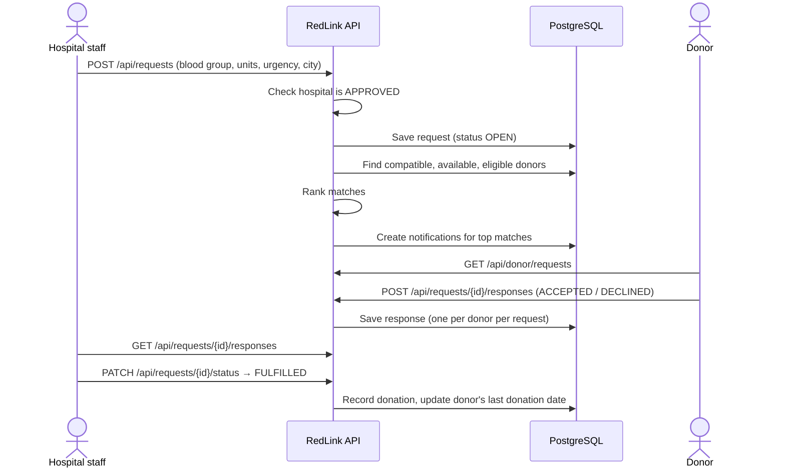
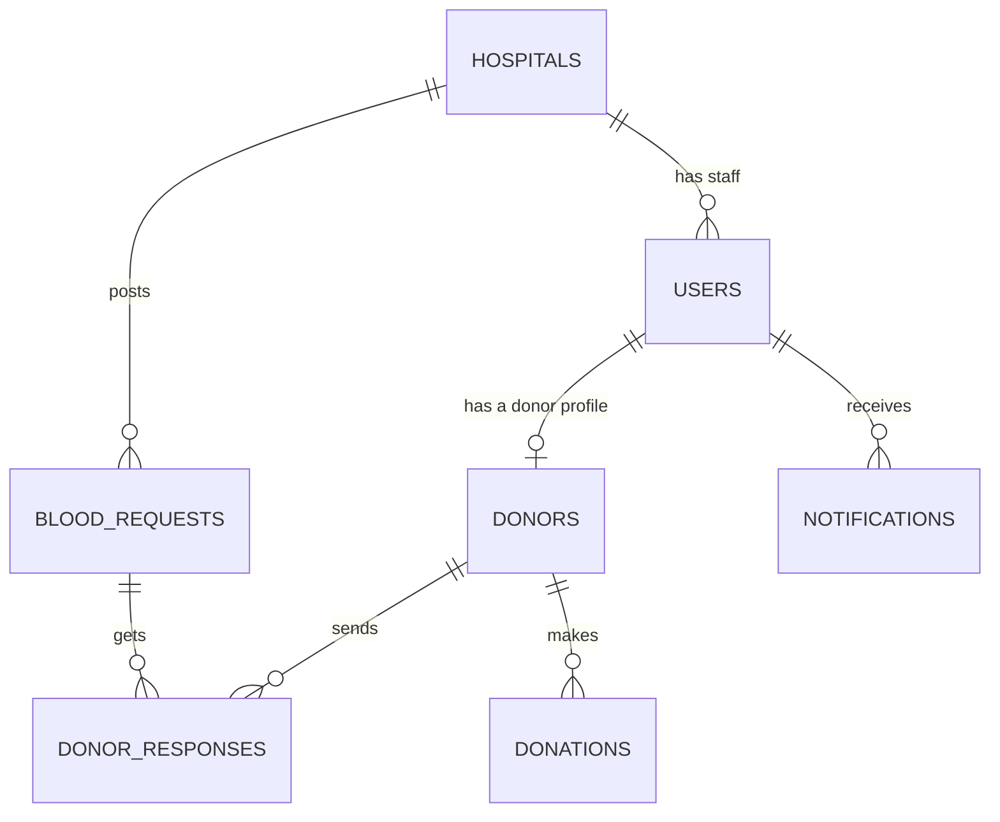

# RedLink 🩸

[](https://github.com/kbpkavisika/RedLink/actions/workflows/ci.yml)

A blood donor matching and request management system that connects hospitals with suitable blood donors.

RedLink lets a hospital post a request and instantly get a ranked list of compatible, available donors nearby, turning a manual search into a database query.

> **Status: early development.** The project skeleton is in place: React frontend, Spring Boot API and PostgreSQL. The first donor endpoints work end to end. Everything else below describes the target design. See [Roadmap](#roadmap) for what is built and what is planned.

---

## Table of Contents

- [The Problem](#the-problem)
- [Features](#features)
- [How It Works](#how-it-works)
- [Tech Stack](#tech-stack)
- [Architecture](#architecture)
- [Database Design](#database-design)
- [Project Structure](#project-structure)
- [Getting Started](#getting-started)
- [Testing the API](#testing-the-api)
- [Scripts](#scripts)
- [Development Workflow](#development-workflow)
- [Roadmap](#roadmap)

---

## The Problem

When a hospital needs blood urgently, staff often call donors one by one. Many of those donors have the wrong blood type, are still inside their post-donation waiting period, or live in another city. Every wasted call costs time in an emergency.

**RedLink's solution:** a hospital creates a blood request (blood type, units, urgency, city). The system finds every donor whose blood type is compatible, removes anyone unavailable or ineligible, ranks the rest, and notifies the best matches. Each donor can then accept or decline in the app.

---

## Features

Three roles, each with its own view of the system.

| Role | Can do |
|---|---|
| **Admin** | Approve or reject hospital registrations, manage users, view all requests |
| **Hospital staff** | Create blood requests, view matched donors, track responses, mark requests fulfilled |
| **Donor** | Manage profile and availability, view incoming requests, accept or decline, see donation history |

### Core business rules

1. A hospital account must be **approved by an admin** before it can post requests.
2. A donor is **eligible** only if they are marked available **and** at least **90 days** have passed since their last donation.
3. A donor can **respond to a given request only once**.
4. A request starts as `OPEN` and ends as `FULFILLED`, `CANCELLED` or `EXPIRED`. A closed request cannot be reopened.

---

## How It Works

### Main flow: from request to donation



### Hospital onboarding

```
Hospital registers ──► status PENDING ──► Admin reviews ──┬──► APPROVED  (can post requests)
                                                          └──► REJECTED  (cannot post)
```

### Request lifecycle

```
            ┌──► FULFILLED   (hospital got the blood it needed)
  OPEN ─────┼──► CANCELLED   (hospital withdrew the request)
            └──► EXPIRED     (needed-by date passed with no fulfilment)
```

### Matching engine

For a request with blood group **R** in city **C**, a donor is a match when **all** of the following are true:

| Check | Rule |
|---|---|
| Compatible | Donor's blood group can be given to **R** (table below) |
| Available | `donors.available = true` |
| Eligible | `last_donation_date` is empty **or** at least 90 days ago |
| Not already responded | No row in `donor_responses` for this donor and request |

Matches are **ranked** by:
1. Exact blood group match before a compatible substitute (this saves scarce types such as O−)
2. Same city as the request before other cities
3. Longest time since last donation first

**Red cell compatibility** (who a recipient can receive from):

| Recipient | Compatible donors |
|---|---|
| O− | O− |
| O+ | O+, O− |
| A− | A−, O− |
| A+ | A+, A−, O+, O− |
| B− | B−, O− |
| B+ | B+, B−, O+, O− |
| AB− | AB−, A−, B−, O− |
| AB+ | All groups |

---

## Tech Stack

| Layer | Choice | Why |
|---|---|---|
| Frontend | React 19 + TypeScript (Vite) | Component-based UI, type safety, largest job market |
| Backend | Java 25 + Spring Boot 4.1 | Strong OOP, dependency injection, dominant in enterprise Java |
| Data access | Spring Data JPA (Hibernate) | Less boilerplate; entities map directly to relationships |
| Auth | Spring Security + JWT *(planned)* | Stateless, suits a separate frontend, scales without shared session storage |
| Database | PostgreSQL | Relational data with real constraints and transactions |
| API style | REST + JSON | Simple, testable in Postman, universal |
| CI/CD | GitHub Actions (CI live, CD planned) | Tests gate every merge and deploy |
| Hosting | Vercel (frontend), Render (API), Neon (PostgreSQL) *(planned)* | Free tiers suitable for a portfolio project |

Frontend libraries: React Router, Axios, TanStack Query, React Hook Form + Zod, Tailwind CSS, Recharts, React Hot Toast.

---

## Architecture

RedLink is a **layered monolith**: one Spring Boot application split into Controller → Service → Repository layers, backed by one PostgreSQL database, with a separate React single-page frontend.

```
┌──────────────────┐   HTTP/JSON   ┌───────────────────────── Spring Boot ─────────────────────────┐
│ React + TS (SPA) │ ────────────► │ Controller ──► Service ──► Repository ──► │ PostgreSQL │
│  localhost:5173  │  JWT (planned)│  (HTTP only)   (rules)     (JPA)          │   :5432    │
└──────────────────┘               └──────────────── localhost:8080 ───────────────────────────────┘
```

| Layer | Responsibility |
|---|---|
| **Controller** | HTTP only: validates input, calls one service method, returns a status code |
| **Service** | Owns business rules, transactions and the matching engine |
| **Repository** | Spring Data JPA interfaces; no business logic |
| **DTO** | Request and response objects, so entities are never exposed directly |

During development, Vite proxies every `/api/*` request from port 5173 to the backend on port 8080, so no CORS configuration is needed.

---

## Database Design

RedLink uses **7 tables**. The diagram shows how they connect; the sections below list the columns of each table.

### Overview



**Reading the relationships in plain English:**

- A **user** can have **one** donor profile (only if their role is `DONOR`).
- A **hospital** has **many** staff users and posts **many** blood requests.
- A **blood request** gets **many** donor responses, but each donor can respond **once**.
- A **donor** builds up a history of **many** donations.
- A **user** receives **many** notifications.

### Table summary

| Table | What it stores | Example row |
|---|---|---|
| 👤 `users` | Everyone who can log in | *kamal@mail.com, role DONOR* |
| 🏥 `hospitals` | Registered hospitals | *City Hospital, Colombo, APPROVED* |
| 🩸 `donors` | Donor profile details | *O+, Colombo, available* |
| 📋 `blood_requests` | A hospital asking for blood | *2 units of A+, CRITICAL, OPEN* |
| ✅ `donor_responses` | A donor's answer to a request | *Kamal → request #5: ACCEPTED* |
| 💉 `donations` | Completed donations (history) | *Kamal, City Hospital, 2026-05-01* |
| 🔔 `notifications` | Messages sent to users | *"A+ needed urgently at City Hospital"* |

### Columns

**Key:** 🔑 primary key · 🔗 links to another table · ⭐ must be unique

#### 👤 users

| Column | Type | Key | Description |
|---|---|:---:|---|
| `id` | bigint | 🔑 | Auto-generated ID |
| `email` | varchar | ⭐ | Login email |
| `password_hash` | varchar | | Encrypted password (never stored as plain text) |
| `full_name` | varchar | | Person's name |
| `phone` | varchar | | Contact number |
| `role` | varchar | | `ADMIN`, `HOSPITAL_STAFF` or `DONOR` |
| `hospital_id` | bigint | 🔗 hospitals | Only set for hospital staff |
| `enabled` | boolean | | `false` blocks login |
| `created_at` | timestamp | | When the account was created |

#### 🏥 hospitals

| Column | Type | Key | Description |
|---|---|:---:|---|
| `id` | bigint | 🔑 | Auto-generated ID |
| `name` | varchar | | Hospital name |
| `registration_no` | varchar | ⭐ | Official registration number |
| `address` | varchar | | Street address |
| `city` | varchar | | Used for matching nearby donors |
| `phone` | varchar | | Contact number |
| `status` | varchar | | `PENDING` → `APPROVED` or `REJECTED` |
| `approved_by` | bigint | 🔗 users | The admin who approved it |
| `approved_at` | timestamp | | When it was approved |
| `created_at` | timestamp | | When it registered |

#### 🩸 donors

| Column | Type | Key | Description |
|---|---|:---:|---|
| `id` | bigint | 🔑 | Auto-generated ID |
| `user_id` | bigint | 🔗 users ⭐ | The donor's login (one profile per user) |
| `blood_group` | varchar | | `A+` `A-` `B+` `B-` `AB+` `AB-` `O+` `O-` |
| `date_of_birth` | date | | To check the donor's age |
| `city` | varchar | | Where the donor lives |
| `available` | boolean | | Donor can switch this off |
| `last_donation_date` | date | | Used for the 90-day rule |

#### 📋 blood_requests

| Column | Type | Key | Description |
|---|---|:---:|---|
| `id` | bigint | 🔑 | Auto-generated ID |
| `hospital_id` | bigint | 🔗 hospitals | Hospital that needs blood |
| `created_by` | bigint | 🔗 users | Staff member who posted it |
| `blood_group` | varchar | | Blood group needed |
| `units_needed` | int | | Must be more than 0 |
| `urgency` | varchar | | `LOW`, `MEDIUM`, `HIGH` or `CRITICAL` |
| `city` | varchar | | Where the blood is needed |
| `status` | varchar | | `OPEN`, `FULFILLED`, `CANCELLED` or `EXPIRED` |
| `needed_by` | timestamp | | Deadline; after this the request expires |
| `created_at` | timestamp | | When it was posted |
| `closed_at` | timestamp | | When it stopped being `OPEN` |

#### ✅ donor_responses

| Column | Type | Key | Description |
|---|---|:---:|---|
| `id` | bigint | 🔑 | Auto-generated ID |
| `request_id` | bigint | 🔗 blood_requests | Which request |
| `donor_id` | bigint | 🔗 donors | Which donor |
| `status` | varchar | | `ACCEPTED` or `DECLINED` |
| `responded_at` | timestamp | | When the donor answered |

⭐ `request_id` + `donor_id` together are unique, so a donor can't answer the same request twice.

#### 💉 donations

| Column | Type | Key | Description |
|---|---|:---:|---|
| `id` | bigint | 🔑 | Auto-generated ID |
| `donor_id` | bigint | 🔗 donors | Who donated |
| `hospital_id` | bigint | 🔗 hospitals | Where they donated |
| `request_id` | bigint | 🔗 blood_requests | The request it fulfilled (optional) |
| `donation_date` | date | | Also updates the donor's `last_donation_date` |
| `units` | int | | Units donated |

#### 🔔 notifications

| Column | Type | Key | Description |
|---|---|:---:|---|
| `id` | bigint | 🔑 | Auto-generated ID |
| `user_id` | bigint | 🔗 users | Who receives it |
| `request_id` | bigint | 🔗 blood_requests | Related request (optional) |
| `message` | varchar | | Text shown to the user |
| `is_read` | boolean | | `true` once opened |
| `created_at` | timestamp | | When it was sent |

### How the business rules are enforced

| Business rule | How the system makes sure |
|---|---|
| One account per email | `email` is unique in `users` |
| One donor profile per user | `user_id` is unique in `donors` |
| A donor answers a request only once | `request_id` + `donor_id` are unique together in `donor_responses` |
| Only approved hospitals can post requests | The service checks `hospitals.status = APPROVED` before saving |
| Donor must wait 90 days between donations | The matching query skips donors whose `last_donation_date` is less than 90 days ago |
| Only valid values (blood group, role, status) | Java enums + database `CHECK` constraints |
| Requests need at least 1 unit | `CHECK (units_needed > 0)` |

### Good to know

- **Naming:** Java uses camelCase (`bloodGroup`); the database uses snake_case (`blood_group`). Hibernate converts between them automatically.
- **Speed:** indexes on `donors (blood_group, available, city)` and `blood_requests (status, city)` keep the matching query fast.
- **Current state:** only the `donors` table exists so far. For now it stores `name` and `phone` directly; these move to `users` when login is added. Tables are created automatically from the Java entities (`ddl-auto=update`). Flyway migrations will replace this before deployment.

---

## Project Structure

```
RedLink/
├── .github/workflows/ci.yml         # CI pipeline (GitHub Actions)
│
├── frontend/                        # React + TypeScript (Vite)
│   ├── src/
│   │   ├── api/client.ts            # Axios instance (baseURL: /api)
│   │   ├── components/              # Reusable UI components
│   │   ├── hooks/                   # Custom hooks
│   │   ├── pages/                   # Route pages (Home, Donors, …)
│   │   ├── types/index.ts           # TypeScript types matching backend DTOs
│   │   ├── App.tsx                  # Routes
│   │   └── main.tsx                 # Entry point
│   └── vite.config.ts               # Dev server + /api proxy to :8080
│
└── backend/                         # Spring Boot REST API
    ├── src/main/java/com/redlink/backend/
    │   ├── controller/              # REST endpoints (/api/...)
    │   ├── service/                 # Business logic & matching engine
    │   ├── repository/              # Spring Data JPA repositories
    │   ├── model/                   # JPA entities (database tables)
    │   ├── dto/                     # Request/response objects
    │   └── BackendApplication.java  # Entry point
    ├── src/main/resources/
    │   ├── application.properties         # Shared config (committed)
    │   └── application-local.properties   # Your DB password (git-ignored)
    └── pom.xml
```

---

## Getting Started

### Prerequisites

| Tool | Version | Check with |
|---|---|---|
| [Node.js](https://nodejs.org/) | 20 or later | `node -v` |
| [JDK](https://www.oracle.com/java/technologies/downloads/) | 25 or later | `java -version` |
| [PostgreSQL](https://www.postgresql.org/download/) | 18 (includes pgAdmin) | pgAdmin opens and connects |
| [Git](https://git-scm.com/) | any | `git --version` |

Maven does **not** need to be installed. The backend includes the Maven wrapper (`mvnw`).

### 1. Clone the repository

```bash
git clone https://github.com/kbpkavisika/RedLink.git
cd RedLink
```

### 2. Create the database

Make sure the PostgreSQL service is running. Then, in **pgAdmin**, right-click the `postgres` database, choose **Query Tool**, and run:

```sql
CREATE DATABASE "redLink";
```

The name is **case-sensitive**. Keep the double quotes, or PostgreSQL will create `redlink` instead and the backend won't find it.

### 3. Configure the backend

The database password is kept out of git. Create the file `backend/src/main/resources/application-local.properties` with:

```properties
spring.datasource.password=YOUR_POSTGRES_PASSWORD
```

The rest of the settings are in `application.properties`:

| Setting | Default |
|---|---|
| Database URL | `jdbc:postgresql://localhost:5432/redLink` |
| Username | `postgres` |
| API port | `8080` |

### 4. Start the backend

```bash
cd backend
./mvnw spring-boot:run        # macOS / Linux / Git Bash
.\mvnw.cmd spring-boot:run    # Windows (PowerShell / Command Prompt)
```

The first run downloads dependencies and takes a few minutes. The backend is ready when you see:

```
Tomcat started on port 8080 (http)
Started BackendApplication in X seconds
```

Tables are created automatically at this point. **Leave this terminal open.**

### 5. Start the frontend

In a **second terminal**:

```bash
cd frontend
npm install     # first time only
npm run dev
```

Open **http://localhost:5173**. Requests to `/api/*` are forwarded to the backend on port 8080.

### Troubleshooting

| Error | Cause and fix |
|---|---|
| `database "redLink" does not exist` | Create it (step 2) and check the exact spelling and case |
| `password authentication failed` | Wrong password in `application-local.properties` |
| `Connection to localhost:5432 refused` | PostgreSQL isn't running; start it in `services.msc` (Windows) |
| `Port 8080 was already in use` | Another app is using the port; stop it or change `server.port` and the proxy target in `vite.config.ts` |
| Frontend shows no data / 404 on `/api/...` | The backend isn't running, or the endpoint path doesn't start with `/api` |
| `BUILD SUCCESS` but the app stopped | Maven finished, but the app failed. Scroll up to the first `ERROR` / `Caused by:` line |

---

## Testing the API

Start the backend first (step 4). All endpoints are under `http://localhost:8080/api`.

### Available endpoints

| Method | Endpoint | Description | Status |
|---|---|---|---|
| `GET` | `/api/donors` | List all donors | ✅ Implemented |
| `POST` | `/api/donors` | Create a donor | ✅ Implemented |

### Option 1: Terminal

**Git Bash / macOS / Linux (curl):**

```bash
# Create a donor
curl -X POST http://localhost:8080/api/donors \
  -H "Content-Type: application/json" \
  -d '{"name":"Kamal Perera","bloodGroup":"O+","phone":"0771234567","city":"Colombo","available":true,"lastDonationDate":"2026-05-01"}'

# List donors
curl http://localhost:8080/api/donors
```

**Windows PowerShell:**

```powershell
# Create a donor
Invoke-RestMethod -Uri http://localhost:8080/api/donors -Method Post -ContentType "application/json" `
  -Body '{"name":"Kamal Perera","bloodGroup":"O+","phone":"0771234567","city":"Colombo","available":true,"lastDonationDate":"2026-05-01"}'

# List donors
Invoke-RestMethod http://localhost:8080/api/donors
```

In Windows PowerShell 5.1, `curl` is an alias for `Invoke-WebRequest`. Use `curl.exe` if you want real curl.

**Expected response** (`200 OK`):

```json
[
  {
    "id": 1,
    "name": "Kamal Perera",
    "bloodGroup": "O+",
    "phone": "0771234567",
    "city": "Colombo",
    "available": true,
    "lastDonationDate": "2026-05-01"
  }
]
```

### Option 2: Postman

1. Create a new request: **POST** `http://localhost:8080/api/donors`
2. **Body** → **raw** → **JSON**, and paste the donor JSON above
3. Click **Send**. You should get `200 OK` with the saved donor and its new `id`
4. Change the method to **GET** and send again to list all donors

Tip: create a Postman **environment** with a variable `baseUrl = http://localhost:8080/api` and use `{{baseUrl}}/donors`. Switching to the deployed API later then only needs a different environment.

### Option 3: Through the frontend

With both servers running:

- **http://localhost:5173/api/donors** returns the same JSON, which proves the Vite proxy reaches the backend.
- **http://localhost:5173/donors** shows the donor list page.

### Check the data in the database

In pgAdmin: **redLink → Schemas → public → Tables → donors**, then right-click and choose **View/Edit Data → All Rows**. Or open the Query Tool on `redLink` and run:

```sql
SELECT * FROM donors;
```

If the table doesn't appear, right-click **Tables** and choose **Refresh**.

### Automated tests

```bash
cd backend
./mvnw test
```

The current test (`contextLoads`) starts the whole application, so **PostgreSQL must be running** for it to pass.

### Planned endpoints

| Method | Endpoint | Role | Description |
|---|---|---|---|
| `POST` | `/api/auth/register` | Public | Register as donor or hospital |
| `POST` | `/api/auth/login` | Public | Log in, receive a JWT |
| `GET` | `/api/admin/hospitals?status=PENDING` | Admin | Hospitals waiting for approval |
| `PATCH` | `/api/admin/hospitals/{id}/status` | Admin | Approve or reject a hospital |
| `POST` | `/api/requests` | Hospital | Create a blood request |
| `GET` | `/api/requests/{id}/matches` | Hospital | Ranked list of matching donors |
| `GET` | `/api/requests/{id}/responses` | Hospital | Donor responses to a request |
| `PATCH` | `/api/requests/{id}/status` | Hospital | Mark fulfilled or cancelled |
| `GET` | `/api/donor/me` | Donor | View own profile |
| `PATCH` | `/api/donor/me/availability` | Donor | Toggle availability |
| `GET` | `/api/donor/requests` | Donor | Incoming matching requests |
| `POST` | `/api/requests/{id}/responses` | Donor | Accept or decline (once) |
| `GET` | `/api/donor/donations` | Donor | Donation history |

Once JWT auth is added, protected endpoints need the header `Authorization: Bearer <token>` from the login response.

---

## Scripts

### Frontend (`frontend/`)

| Command | Description |
|---|---|
| `npm run dev` | Start the development server (http://localhost:5173) |
| `npm run build` | Type-check and build for production |
| `npm run lint` | Run ESLint |
| `npm run preview` | Preview the production build |

### Backend (`backend/`)

On Windows, use `.\mvnw.cmd` instead of `./mvnw`.

| Command | Description |
|---|---|
| `./mvnw spring-boot:run` | Start the API (http://localhost:8080) |
| `./mvnw test` | Run tests |
| `./mvnw clean package` | Build a runnable JAR in `target/` |

---

## Development Workflow

`main` is protected: changes can't be pushed to it directly. Every change goes through a pull request, and both CI checks must pass before it can be merged.

```
feature branch ──► pull request ──► CI runs ──┬── ❌ fails  → fix and push again (CI re-runs)
                                              └── ✅ passes → merge into main
```

### Steps

```bash
git checkout main
git pull
git checkout -b feature/your-change    # new branch for each task

# ...make changes...

git add .
git commit -m "feat: describe your change"
git push -u origin feature/your-change
```

Then open a pull request into `main` on GitHub and merge it once both checks are green.

### Branch names

| Prefix | Use for |
|---|---|
| `feature/` | New functionality |
| `fix/` | Bug fixes |
| `docs/` | README and documentation |
| `ci/` | Workflow and pipeline changes |

### What CI checks

The workflow in [`.github/workflows/ci.yml`](.github/workflows/ci.yml) runs on every pull request and every push to `main`:

| Job | Steps |
|---|---|
| **Backend (build + test)** | Starts a temporary PostgreSQL 18 database, sets up Java 25, runs `./mvnw verify` (compile + tests) |
| **Frontend (lint + build)** | Sets up Node.js 24, runs `npm ci`, `npm run lint` and `npm run build` |

Run the same checks locally before pushing:

```bash
cd frontend && npm run lint && npm run build
cd ../backend && ./mvnw verify          # Windows: .\mvnw.cmd verify
```

---

## Roadmap

- [x] Project setup: React + TypeScript frontend, Spring Boot backend, PostgreSQL
- [x] Frontend → backend → database connection (`/api/donors`)
- [ ] Full database schema (users, hospitals, requests, responses, donations, notifications)
- [ ] DTOs, input validation and global error handling
- [ ] Authentication and roles with Spring Security + JWT
- [ ] Hospital registration and admin approval
- [ ] Blood requests and the matching engine
- [ ] Donor responses and donation history
- [ ] Notifications
- [ ] Role-based dashboards in the frontend
- [ ] Flyway database migrations
- [x] GitHub Actions CI (backend tests + frontend lint/build on every pull request)
- [x] Branch protection on `main` (pull request + passing CI required)
- [ ] Dockerize the backend
- [ ] Deployment (Vercel, Render, Neon)
