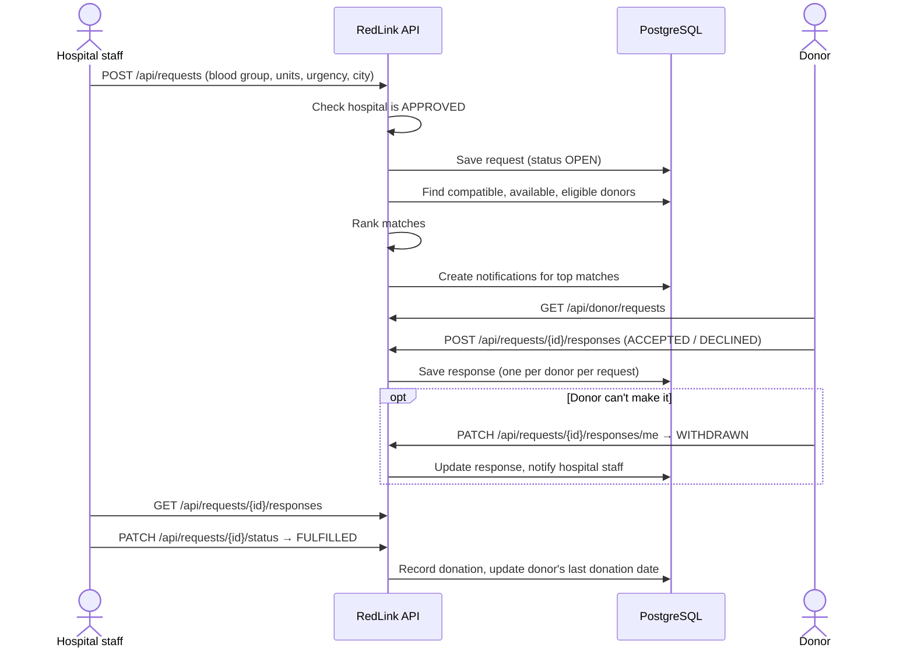
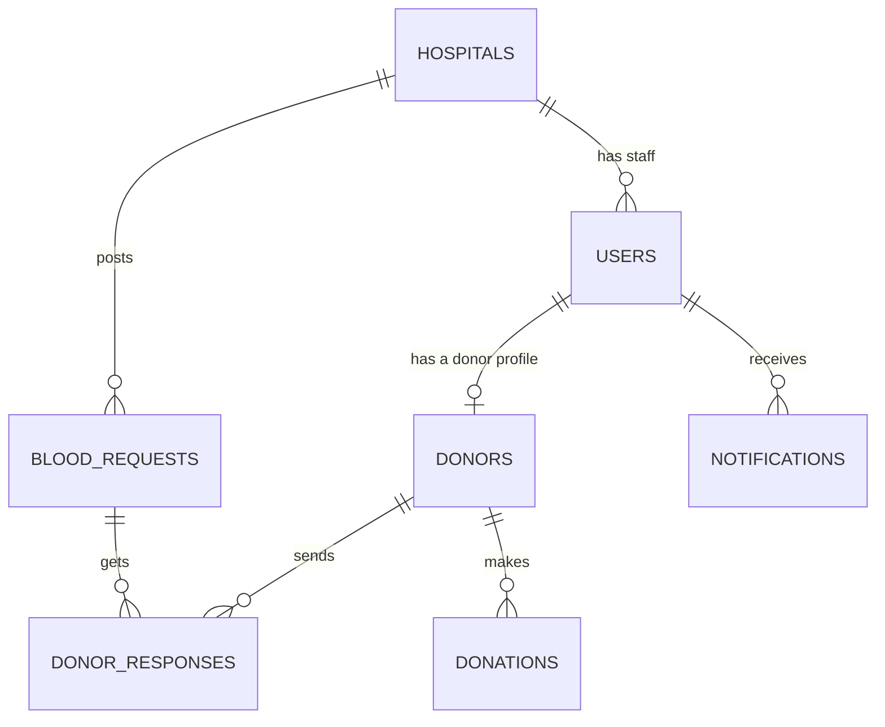

# RedLink 🩸

[](https://github.com/kbpkavisika/RedLink/actions/workflows/ci.yml)

A blood donor matching and request management system that connects hospitals with suitable blood donors.

RedLink lets a hospital post a request and instantly get a ranked list of compatible, available donors nearby, turning a manual search into a database query.

> **Status: early development.** The project skeleton is in place: React frontend, Spring Boot API and PostgreSQL. The full database schema is created by Flyway, the API has its service layer and error handling, and the donor read endpoints work end to end. The frontend has its design system, app shell and role-based routing; sign-in arrives with authentication. Everything else below describes the target design. See [Roadmap](#roadmap) for what is built and what is planned.

---

## Table of Contents

- [The Problem](#the-problem)
- [Features](#features)
- [How It Works](#how-it-works)
- [Tech Stack](#tech-stack)
- [Architecture](#architecture)
- [Frontend](#frontend)
- [Database Design](#database-design)
- [Project Structure](#project-structure)
- [Getting Started](#getting-started)
- [Testing the API](#testing-the-api)
- [Scripts](#scripts)
- [Development Workflow](#development-workflow)
- [Roadmap](#roadmap)

---

## The Problem

When a hospital needs blood urgently, staff often call donors one by one. Many of those donors have the wrong blood type, are still inside their post-donation waiting period, or live in another city. Every wasted call costs time in an emergency.

**RedLink's solution:** a hospital creates a blood request (blood type, units, urgency, city). The system finds every donor whose blood type is compatible, removes anyone unavailable or ineligible, ranks the rest, and notifies the best matches. Each donor can then accept or decline in the app.

---

## Features

Three roles, each with its own view of the system.

| Role | Can do |
|---|---|
| **Admin** | Approve or reject hospital registrations (with a reason), manage users, add staff to a hospital, reset a user's password, view all requests |
| **Hospital staff** | Register their hospital, create blood requests, view matched donors, track responses (including withdrawals), mark requests fulfilled or cancelled |
| **Donor** | Manage profile and availability, view incoming requests, accept or decline, withdraw after accepting, see donation history |

Every user can also change their own password.

### Core business rules

1. A hospital account must be **approved by an admin** before it can post requests.
2. A donor is **eligible** only if they are marked available **and** at least **90 days** have passed since their last donation.
3. A donor **responds to a request once** (accept or decline). After accepting, they may **withdraw** while the request is still open, but they cannot respond to it again.
4. A request starts as `OPEN` and ends as `FULFILLED`, `CANCELLED` or `EXPIRED`. A closed request cannot be reopened.
5. When a request is posted, the system notifies the **top-ranked matches**: `units needed × urgency multiplier`, capped at 25. If there are fewer matches than that, all of them are notified.
6. Registering a hospital also creates its **first staff account**. The admin adds any further staff.
7. The **first admin is created automatically** at startup from environment variables. Nobody can register themselves as an admin.
8. **Password reset by email is not in v1.** An admin sets a temporary password, and the user changes it after logging in.

---

## How It Works

### Main flow: from request to donation



### Hospital onboarding

```
Hospital registers ──► status PENDING ──► Admin reviews ──┬──► APPROVED  (can post requests)
                                                          └──► REJECTED  (cannot post, reason shown)
```

One registration form creates both the hospital (`PENDING`) and its first staff user (`HOSPITAL_STAFF`) in a single transaction. If the email or registration number already exists, nothing is saved.

The staff user can log in at every stage, so they always see where their hospital stands:

| Hospital status | What staff see | Can post requests? |
|---|---|:---:|
| `PENDING` | "An admin is reviewing your registration. This usually takes 1–2 working days." | ❌ |
| `APPROVED` | Full dashboard | ✅ |
| `REJECTED` | "Registration was not approved", with the admin's reason | ❌ |

Further staff accounts are created by the admin in **Manage users**.

### Accounts and passwords

- **First admin:** when the backend starts, a seeder checks whether any admin exists. If none does, it creates one from `redlink.admin.email` and `redlink.admin.password`, which come from `application-local.properties` locally or from environment variables when deployed. The password is never committed.
- **Registration** only creates `DONOR` or `HOSPITAL_STAFF` users. Any `role` sent in the request body is ignored.
- **Forgotten password (v1):** the "Forgot password?" link tells the user to contact the admin. The admin sets a temporary password, and `must_change_password` makes the user choose a new one at their next login.

### Request lifecycle

```
            ┌──► FULFILLED   (hospital got the blood it needed)
  OPEN ─────┼──► CANCELLED   (hospital withdrew the request)
            └──► EXPIRED     (needed-by date passed with no fulfilment)
```

### Donor response lifecycle

```
            ┌──► ACCEPTED ──► WITHDRAWN   (donor can't make it after all)
 no reply ──┤
            └──► DECLINED
```

- Each donor has **at most one** response per request. Withdrawing updates that row; it never adds a new one.
- Only `ACCEPTED` → `WITHDRAWN` is allowed, and only while the request is `OPEN`. `DECLINED` and `WITHDRAWN` are final.
- When a donor withdraws, the hospital's staff are notified ("Kamal Perera can no longer donate for #RQ-5").

| Invalid action | API response |
|---|---|
| Responding a second time | `409 Conflict`: "You've already responded to this request." |
| Withdrawing a declined response | `409 Conflict`: "Only accepted responses can be withdrawn." |
| Withdrawing after the request closed | `409 Conflict`: "This request is already closed." |

### Matching engine

For a request with blood group **R** in city **C**, a donor is a match when **all** of the following are true:

| Check | Rule |
|---|---|
| Compatible | Donor's blood group can be given to **R** (table below) |
| Available | `donors.available = true` |
| Eligible | `last_donation_date` is empty **or** at least 90 days ago |
| Not already responded | No row in `donor_responses` for this donor and request |

Matches are **ranked** by:
1. Exact blood group match before a compatible substitute (this saves scarce types such as O−)
2. Same city as the request before other cities
3. Longest time since last donation first

**How many donors are notified.** Not every match is notified, so donors aren't flooded with requests that will be filled without them:

```
notified = min(units_needed × urgency multiplier, 25, number of matches)
```

| Urgency | Multiplier | 1 unit | 2 units | 4 units |
|---|:---:|:---:|:---:|:---:|
| `LOW` | 2 | 2 | 4 | 8 |
| `MEDIUM` | 3 | 3 | 6 | 12 |
| `HIGH` | 5 | 5 | 10 | 20 |
| `CRITICAL` | 8 | 8 | 16 | 25 (cap) |

Example: 2 units of A+ at `HIGH` urgency with 46 matches notifies the top 10. The other 36 still appear in the hospital's ranked match list, so staff can contact them directly. If there are no matches, the request is still saved and the hospital sees suggestions instead.

The multipliers and cap live in `application.properties`, so they can be tuned without code changes:

```properties
redlink.matching.multiplier.low=2
redlink.matching.multiplier.medium=3
redlink.matching.multiplier.high=5
redlink.matching.multiplier.critical=8
redlink.matching.max-notified=25
```

**Red cell compatibility** (who a recipient can receive from):

| Recipient | Compatible donors |
|---|---|
| O− | O− |
| O+ | O+, O− |
| A− | A−, O− |
| A+ | A+, A−, O+, O− |
| B− | B−, O− |
| B+ | B+, B−, O+, O− |
| AB− | AB−, A−, B−, O− |
| AB+ | All groups |

---

## Tech Stack

| Layer | Choice | Why |
|---|---|---|
| Frontend | React 19 + TypeScript (Vite) | Component-based UI, type safety, largest job market |
| Backend | Java 25 + Spring Boot 4.1 | Strong OOP, dependency injection, dominant in enterprise Java |
| Data access | Spring Data JPA (Hibernate) | Less boilerplate; entities map directly to relationships |
| Auth | Spring Security + JWT *(planned)* | Stateless, suits a separate frontend, scales without shared session storage |
| Database | PostgreSQL | Relational data with real constraints and transactions |
| API style | REST + JSON | Simple, testable in Postman, universal |
| CI/CD | GitHub Actions (CI live, CD planned) | Tests gate every merge and deploy |
| Hosting | Vercel (frontend), Render (API), Neon (PostgreSQL) *(planned)* | Free tiers suitable for a portfolio project |

Frontend libraries: React Router, Axios, TanStack Query, React Hook Form + Zod, Tailwind CSS, Lucide icons, clsx, Recharts, React Hot Toast.

---

## Architecture

RedLink is a **layered monolith**: one Spring Boot application split into Controller → Service → Repository layers, backed by one PostgreSQL database, with a separate React single-page frontend.

```
┌──────────────────┐   HTTP/JSON   ┌───────────────────────── Spring Boot ─────────────────────────┐
│ React + TS (SPA) │ ────────────► │ Controller ──► Service ──► Repository ──► │ PostgreSQL │
│  localhost:5173  │  JWT (planned)│  (HTTP only)   (rules)     (JPA)          │   :5432    │
└──────────────────┘               └──────────────── localhost:8080 ───────────────────────────────┘
```

| Layer | Responsibility | Never does |
|---|---|---|
| **Controller** | HTTP only: validates the request DTO with `@Valid`, calls **one** service method, returns the result | Business rules or repository calls |
| **Service** | Business rules, transactions (`@Transactional`, read-only by default), entity ↔ DTO mapping; throws `ApiException`s | Anything HTTP (`ResponseEntity`, status codes) |
| **Repository** | Spring Data JPA queries | Business logic |
| **DTO** | Java `record`s for what goes in and out of the API, so entities are never exposed | Behaviour |
| **Exception handler** | `GlobalExceptionHandler` turns every error into the one [error format](#error-format) | Business logic |

`DonorController` → `DonorService` → `DonorRepository` is the reference example to copy for new features.

**Rules that keep the layers honest**

- Request DTOs contain only the fields a client may set. A registration DTO has no `role` field, so nobody can make themselves an admin.
- Field rules (not blank, positive, email format) are annotations on the request DTO. Rules that need data ("email already registered", "hospital not approved") live in the service.
- `spring.jpa.open-in-view=false`: the database connection closes when the service method ends, so lazy-loading an entity outside a service fails loudly. Load what you need in the service (e.g. `join fetch`) and return a DTO.

### Error format

Every error, from any endpoint, has the same JSON shape:

```json
{
  "status": 400,
  "error": "Bad Request",
  "message": "Some fields are invalid.",
  "fieldErrors": [
    { "field": "unitsNeeded", "message": "must be greater than 0" }
  ],
  "ref": "7f3a-19c2",
  "timestamp": "2026-09-30T10:15:00Z",
  "path": "/api/requests"
}
```

| Field | Use in the frontend |
|---|---|
| `message` | Plain sentence shown to the user |
| `fieldErrors` | Message under each invalid form field (empty when not a form error) |
| `ref` | Shown as `Error 500 · ref 7f3a-19c2`. The same ref is in the server log, so a reported ref leads to the exact error |
| `status` | Decides the screen state: 403 → Blocked, 409 → inline message, 5xx → Error with "Try again" |

Services signal expected problems by throwing one of these; the handler picks the status:

| Exception | Status | Example |
|---|---|---|
| `NotFoundException` | 404 | "Donor 99 was not found." |
| `ConflictException` | 409 | "You've already responded to this request." |
| `ForbiddenException` | 403 | "Posting unlocks after an admin approves your hospital." |
| `BadRequestException` | 400 | "Rejecting a hospital requires a reason." |

The handler also covers invalid fields (400), broken JSON or an unknown value such as `"bloodGroup": "C+"` (400), a non-numeric ID (400), unknown URLs (404), wrong HTTP methods (405), non-JSON bodies (415) and database constraint conflicts (409). Anything unexpected returns 500 with a generic message; stack traces, SQL and class names never reach the client and are logged with the `ref` instead.

During development, Vite proxies every `/api/*` request from port 5173 to the backend on port 8080, so no CORS configuration is needed.

---

## Frontend

The React app follows the design system in [`design.md`](design.md). It is a web dashboard only; there is no mobile app, but every page works at tablet and phone widths.

### How it fits together

```
main.tsx
  └─ QueryClientProvider        caches API data, retries server errors once, never 4xx
       └─ AuthProvider          who is signed in: user, role, login(), logout()
            └─ App (routes)     role guards → AppShell (sidebar + top bar) → page
       └─ Toaster               short confirmations after actions

api/client.ts (Axios)
  ├─ adds  Authorization: Bearer <token>
  └─ turns every failure into an ApiError; a 401 on a signed-in request signs the user out
```

### Design tokens

All colours, fonts, the type scale, radii and shadows from `design.md` are Tailwind v4 theme variables in [`src/index.css`](frontend/src/index.css), so they become classes:

| Token | Classes |
|---|---|
| `--color-primary`, `--color-ink`, `--color-text-muted`, … | `bg-primary`, `text-ink`, `text-text-muted`, `border-border` |
| `--font-display`, `--font-mono` | `font-display`, `font-mono` |
| `--text-display-lg`, `--text-title-md`, `--text-caption`, … | `text-display-lg` (size, line height and weight together) |
| `--radius-2xl`, `--shadow-urgent`, `--shadow-focus` | `rounded-2xl`, `shadow-urgent`, `shadow-focus` |

Tailwind's default palette is switched off, so off-brand colours such as `text-gray-500` don't exist. Every variable is also available in plain CSS as `var(--color-ink)`.

### UI components

Import from [`src/components/ui`](frontend/src/components/ui/): `import { Button, Panel } from '../components/ui'`.

| Component | Use |
|---|---|
| `Button`, `LinkButton` | `primary` (one per view), `dark`, `outline`, `text`, `icon` (requires `aria-label`); sizes `sm`, `md`, `lg`; `loading` |
| `Input` | Label, hint, error message wired to `aria-describedby`; works with React Hook Form |
| `Badge`, `Chip`, `UrgencyTag`, `BloodGroupBadge` | Status pills, filter chips, urgency (only Critical is red), blood group tiles shown with a true minus sign (`A−`) |
| `Panel`, `Table` | The container for all data; a typed table with 56px rows |
| `Switch`, `StepProgress` | Availability toggle; multi-stage status such as hospital approval |
| `StateView`, `Skeleton` | The six screen states below |

Every data view shows one of six states, all from `StateView`:

| State | When |
|---|---|
| `loading` | The query is pending; skeleton rows mirror the real layout |
| `empty` | Nothing exists yet; explain the value and offer one primary action |
| `no-results` | Filters matched nothing; keep the chips visible and suggest alternatives |
| `error` | The request failed; shows the `ApiError` message, **Try again** and `Error 504 · ref 7f3a-19c2` |
| `success` | An action finished; say what happened in numbers and link to the next step |
| `blocked` | Not allowed yet, e.g. a hospital awaiting approval; say why, who and how long |

### Routes and roles

| Path | Who |
|---|---|
| `/login`, `/register/donor`, `/register/hospital`, `/forgot-password` | Public (signed-in users are sent home) |
| `/hospital`, `/hospital/requests`, `/hospital/requests/new`, `/hospital/requests/:id` | Hospital staff |
| `/donor`, `/donor/requests`, `/donor/history`, `/donor/profile` | Donors |
| `/admin/hospitals`, `/admin/users`, `/admin/requests`, `/admin/donors` | Admins |
| `/change-password` | Any signed-in user |

`/` sends each user to their home. `RequireAuth` sends signed-out users to `/login?from=…`, users with a temporary password to `/change-password`, and users on another role's page back to their own home. This is for convenience only: the backend's 401 and 403 are the real protection. Pages not built yet show a "coming soon" placeholder.

### Development tools

With `npm run dev`, **http://localhost:5173/dev/components** shows every component and screen state and lets you **sign in as a test user** (admin, hospital staff approved / pending / rejected, donor, donor with a temporary password) before the real login exists. The gallery and the test sign-in are left out of production builds.

### Adding a page

1. **API function** in `src/api/` (e.g. `getRequests()`), plus query keys.
2. **Query hook** in `src/hooks/` typed with `ApiError`: `useQuery<BloodRequest[], ApiError>(…)`.
3. **Page** in `src/pages/<role>/` using `Panel` + `Table` and a `StateView` for loading, error and empty. [`DonorsPage`](frontend/src/pages/admin/DonorsPage.tsx) is the reference.
4. **Route** in [`App.tsx`](frontend/src/App.tsx) inside the right role group; add a sidebar link in [`navigation.ts`](frontend/src/components/layout/navigation.ts) if it needs one.
5. **Types** in `src/types/index.ts`, matching the backend DTO exactly.

---

## Database Design

RedLink uses **7 tables**. The diagram shows how they connect; the sections below list the columns of each table.

### Overview



**Reading the relationships in plain English:**

- A **user** can have **one** donor profile (only if their role is `DONOR`).
- A **hospital** has **many** staff users and posts **many** blood requests.
- A **blood request** gets **many** donor responses, but each donor can respond **once**.
- A **donor** builds up a history of **many** donations.
- A **user** receives **many** notifications.

### Table summary

| Table | What it stores | Example row |
|---|---|---|
| 👤 `users` | Everyone who can log in | *kamal@mail.com, role DONOR* |
| 🏥 `hospitals` | Registered hospitals | *City Hospital, Colombo, APPROVED* |
| 🩸 `donors` | Donor profile details | *O+, Colombo, available* |
| 📋 `blood_requests` | A hospital asking for blood | *2 units of A+, CRITICAL, OPEN* |
| ✅ `donor_responses` | A donor's answer to a request | *Kamal → request #5: ACCEPTED* |
| 💉 `donations` | Completed donations (history) | *Kamal, City Hospital, 2026-05-01* |
| 🔔 `notifications` | Messages sent to users | *"A+ needed urgently at City Hospital"* |

### Columns

**Key:** 🔑 primary key · 🔗 links to another table · ⭐ must be unique

#### 👤 users

| Column | Type | Key | Description |
|---|---|:---:|---|
| `id` | bigint | 🔑 | Auto-generated ID |
| `email` | varchar | ⭐ | Login email |
| `password_hash` | varchar | | Encrypted password (never stored as plain text) |
| `full_name` | varchar | | Person's name |
| `phone` | varchar | | Contact number |
| `role` | varchar | | `ADMIN`, `HOSPITAL_STAFF` or `DONOR` |
| `hospital_id` | bigint | 🔗 hospitals | Only set for hospital staff |
| `enabled` | boolean | | `false` blocks login |
| `must_change_password` | boolean | | `true` after an admin sets a temporary password; the user must choose a new one at next login |
| `created_at` | timestamp | | When the account was created |

#### 🏥 hospitals

| Column | Type | Key | Description |
|---|---|:---:|---|
| `id` | bigint | 🔑 | Auto-generated ID |
| `name` | varchar | | Hospital name |
| `registration_no` | varchar | ⭐ | Official registration number |
| `address` | varchar | | Street address |
| `city` | varchar | | Used for matching nearby donors |
| `phone` | varchar | | Contact number |
| `status` | varchar | | `PENDING` → `APPROVED` or `REJECTED` |
| `approved_by` | bigint | 🔗 users | The admin who approved it |
| `approved_at` | timestamp | | When it was approved |
| `rejection_reason` | varchar | | Why the admin rejected it (only set when `REJECTED`) |
| `created_at` | timestamp | | When it registered |

#### 🩸 donors

| Column | Type | Key | Description |
|---|---|:---:|---|
| `id` | bigint | 🔑 | Auto-generated ID |
| `user_id` | bigint | 🔗 users ⭐ | The donor's login (one profile per user) |
| `blood_group` | varchar | | `A+` `A-` `B+` `B-` `AB+` `AB-` `O+` `O-` |
| `date_of_birth` | date | | To check the donor's age |
| `city` | varchar | | Where the donor lives |
| `available` | boolean | | Donor can switch this off |
| `last_donation_date` | date | | Used for the 90-day rule |

#### 📋 blood_requests

| Column | Type | Key | Description |
|---|---|:---:|---|
| `id` | bigint | 🔑 | Auto-generated ID |
| `hospital_id` | bigint | 🔗 hospitals | Hospital that needs blood |
| `created_by` | bigint | 🔗 users | Staff member who posted it |
| `blood_group` | varchar | | Blood group needed |
| `units_needed` | int | | Must be more than 0 |
| `urgency` | varchar | | `LOW`, `MEDIUM`, `HIGH` or `CRITICAL` |
| `city` | varchar | | Where the blood is needed |
| `status` | varchar | | `OPEN`, `FULFILLED`, `CANCELLED` or `EXPIRED` |
| `needed_by` | timestamp | | Deadline; after this the request expires |
| `created_at` | timestamp | | When it was posted |
| `closed_at` | timestamp | | When it stopped being `OPEN` |

#### ✅ donor_responses

| Column | Type | Key | Description |
|---|---|:---:|---|
| `id` | bigint | 🔑 | Auto-generated ID |
| `request_id` | bigint | 🔗 blood_requests | Which request |
| `donor_id` | bigint | 🔗 donors | Which donor |
| `status` | varchar | | `ACCEPTED`, `DECLINED` or `WITHDRAWN` |
| `responded_at` | timestamp | | When the donor first answered |
| `updated_at` | timestamp | | When the status last changed (e.g. withdrawn) |

⭐ `request_id` + `donor_id` together are unique, so a donor can't answer the same request twice. Withdrawing updates the existing row instead of adding a new one.

#### 💉 donations

| Column | Type | Key | Description |
|---|---|:---:|---|
| `id` | bigint | 🔑 | Auto-generated ID |
| `donor_id` | bigint | 🔗 donors | Who donated |
| `hospital_id` | bigint | 🔗 hospitals | Where they donated |
| `request_id` | bigint | 🔗 blood_requests | The request it fulfilled (optional) |
| `donation_date` | date | | Also updates the donor's `last_donation_date` |
| `units` | int | | Units donated |

#### 🔔 notifications

| Column | Type | Key | Description |
|---|---|:---:|---|
| `id` | bigint | 🔑 | Auto-generated ID |
| `user_id` | bigint | 🔗 users | Who receives it |
| `request_id` | bigint | 🔗 blood_requests | Related request (optional) |
| `message` | varchar | | Text shown to the user |
| `is_read` | boolean | | `true` once opened |
| `created_at` | timestamp | | When it was sent |

### How the business rules are enforced

| Business rule | How the system makes sure |
|---|---|
| One account per email | `email` is unique in `users` |
| One donor profile per user | `user_id` is unique in `donors` |
| A donor answers a request only once | `request_id` + `donor_id` are unique together in `donor_responses` |
| Only `ACCEPTED` → `WITHDRAWN`, and only while the request is `OPEN` | The service checks the current response and request status before updating |
| Only approved hospitals can post requests | The service checks `hospitals.status = APPROVED` before saving |
| Hospital and its first staff user are created together | Both inserts run in one transaction; if either fails, neither is saved |
| Nobody can register as an admin | Registration endpoints ignore any `role` in the body; the only automatic admin comes from the startup seeder |
| Donor must wait 90 days between donations | The matching query skips donors whose `last_donation_date` is less than 90 days ago |
| Only valid values (blood group, role, status) | Java enums + database `CHECK` constraints |
| Requests need at least 1 unit | `CHECK (units_needed > 0)` |

### Good to know

- **Naming:** Java uses camelCase (`bloodGroup`); the database uses snake_case (`blood_group`). Hibernate converts between them automatically.
- **Speed:** indexes on `donors (blood_group, available, city)` and `blood_requests (status, city)` keep the matching query fast.
- **Blood groups:** the Java enum uses `A_POS`, `A_NEG`, … because Java names can't contain `+` or `-`. The database and the API always use the label (`A+`, `A-`, …); `BloodGroupConverter` translates between them.

### Migrations (Flyway)

All 7 tables are created by **Flyway** from SQL files in `backend/src/main/resources/db/migration/`, not by Hibernate.

- On startup, Flyway runs any migration that hasn't run yet and records it in the `flyway_schema_history` table.
- Hibernate runs with `ddl-auto=validate`: it never changes tables, it only checks that the Java entities match them. If they don't, the app refuses to start and names the mismatch.
- **Never edit a migration that has already run.** To change the schema, add a new file with the next version number, e.g. `V2__add_donor_notes.sql`.

| Migration | What it does |
|---|---|
| `V1__initial_schema.sql` | Creates all 7 tables with their keys, `CHECK` constraints and indexes |

---

## Project Structure

```
RedLink/
├── .github/workflows/ci.yml         # CI pipeline (GitHub Actions)
│
├── frontend/                        # React + TypeScript (Vite)
│   ├── src/
│   │   ├── api/                     # Axios client (token + ApiError) and API functions
│   │   ├── auth/                    # AuthProvider, useAuth, route guards
│   │   ├── components/
│   │   │   ├── ui/                  # Design-system components (Button, Panel, StateView, …)
│   │   │   └── layout/              # AppShell, sidebar navigation, user menu
│   │   ├── dev/                     # Component gallery + test sign-in (development only)
│   │   ├── hooks/                   # TanStack Query hooks (useDonors, …)
│   │   ├── lib/                     # Query client, token store, ApiError, formatting, roles
│   │   ├── pages/                   # Route pages, grouped by role (admin/, hospital/, …)
│   │   ├── types/index.ts           # TypeScript types matching backend DTOs and enums
│   │   ├── index.css                # Design tokens (Tailwind @theme) and base styles
│   │   ├── App.tsx                  # Routes
│   │   └── main.tsx                 # Entry point and providers
│   └── vite.config.ts               # Dev server + /api proxy to :8080
│
└── backend/                         # Spring Boot REST API
    ├── src/main/java/com/redlink/backend/
    │   ├── controller/              # REST endpoints (/api/...)
    │   ├── service/                 # Business logic & matching engine
    │   ├── repository/              # Spring Data JPA repositories
    │   ├── model/                   # JPA entities (database tables)
    │   │   ├── enums/               # Role, BloodGroup, statuses, urgency
    │   │   └── converter/           # BloodGroup ⇄ "A+" database converter
    │   ├── dto/                     # Request/response records, ApiError
    │   ├── exception/               # ApiException types + GlobalExceptionHandler
    │   └── BackendApplication.java  # Entry point
    ├── src/main/resources/
    │   ├── db/migration/                  # Flyway SQL migrations (V1__…, V2__…)
    │   ├── application.properties         # Shared config (committed)
    │   └── application-local.properties   # Your DB password (git-ignored)
    └── pom.xml
```

---

## Getting Started

### Prerequisites

| Tool | Version | Check with |
|---|---|---|
| [Node.js](https://nodejs.org/) | 20 or later | `node -v` |
| [JDK](https://www.oracle.com/java/technologies/downloads/) | 25 or later | `java -version` |
| [PostgreSQL](https://www.postgresql.org/download/) | 18 (includes pgAdmin) | pgAdmin opens and connects |
| [Git](https://git-scm.com/) | any | `git --version` |

Maven does **not** need to be installed. The backend includes the Maven wrapper (`mvnw`).

### 1. Clone the repository

```bash
git clone https://github.com/kbpkavisika/RedLink.git
cd RedLink
```

### 2. Create the database

Make sure the PostgreSQL service is running. Then, in **pgAdmin**, right-click the `postgres` database, choose **Query Tool**, and run:

```sql
CREATE DATABASE "redLink";
```

The name is **case-sensitive**. Keep the double quotes, or PostgreSQL will create `redlink` instead and the backend won't find it.

### 3. Configure the backend

The database password is kept out of git. Create the file `backend/src/main/resources/application-local.properties` with:

```properties
spring.datasource.password=YOUR_POSTGRES_PASSWORD
```

The rest of the settings are in `application.properties`:

| Setting | Default |
|---|---|
| Database URL | `jdbc:postgresql://localhost:5432/redLink` |
| Username | `postgres` |
| API port | `8080` |

### 4. Start the backend

```bash
cd backend
./mvnw spring-boot:run        # macOS / Linux / Git Bash
.\mvnw.cmd spring-boot:run    # Windows (PowerShell / Command Prompt)
```

The first run downloads dependencies and takes a few minutes. The backend is ready when you see:

```
Tomcat started on port 8080 (http)
Started BackendApplication in X seconds
```

On the first run, Flyway creates all the tables. Look for `Successfully applied 1 migration to schema "public"`. **Leave this terminal open.**

### 5. Start the frontend

In a **second terminal**:

```bash
cd frontend
npm install     # first time only
npm run dev
```

Open **http://localhost:5173**. Requests to `/api/*` are forwarded to the backend on port 8080.

Until the sign-in form exists, open **http://localhost:5173/dev/components** and pick a test user to explore the app (see [Development tools](#development-tools)).

### Troubleshooting

| Error | Cause and fix |
|---|---|
| `database "redLink" does not exist` | Create it (step 2) and check the exact spelling and case |
| `password authentication failed` | Wrong password in `application-local.properties` |
| `Connection to localhost:5432 refused` | PostgreSQL isn't running; start it in `services.msc` (Windows) |
| `Port 8080 was already in use` | Another app is using the port; stop it or change `server.port` and the proxy target in `vite.config.ts` |
| Frontend shows no data / 404 on `/api/...` | The backend isn't running, or the endpoint path doesn't start with `/api` |
| `BUILD SUCCESS` but the app stopped | Maven finished, but the app failed. Scroll up to the first `ERROR` / `Caused by:` line |
| `Found non-empty schema(s) "public" but no schema history table` | Your database has tables from before Flyway was added. Recreate it: in the Query Tool on the `postgres` database run `DROP DATABASE "redLink";` then `CREATE DATABASE "redLink";` (this deletes its data) |
| `Schema-validation: missing column` / `wrong column type` | A Java entity doesn't match the migrations. Fix the entity, or add a new migration; don't edit one that has already run |

---

## Testing the API

Start the backend first (step 4). All endpoints are under `http://localhost:8080/api`.

### Available endpoints

| Method | Endpoint | Description | Status |
|---|---|---|---|
| `GET` | `/api/donors` | List all donors (name and phone come from the donor's user) | ✅ Implemented |
| `GET` | `/api/donors/{id}` | One donor; `404` in the [error format](#error-format) if the ID doesn't exist | ✅ Implemented |

Donors can't be created through the API yet. That will be `POST /api/auth/register/donor` (see [Planned endpoints](#planned-endpoints)).

### Add a sample donor

Until registration exists, add test data in pgAdmin. Open the **Query Tool** on `redLink` and run:

```sql
INSERT INTO users (email, password_hash, full_name, phone, role)
VALUES ('kamal@mail.lk', 'not-a-real-hash', 'Kamal Perera', '0771234567', 'DONOR');

INSERT INTO donors (user_id, blood_group, date_of_birth, city, last_donation_date)
VALUES ((SELECT id FROM users WHERE email = 'kamal@mail.lk'), 'O+', '1995-04-12', 'Colombo', '2026-05-01');
```

A donor always needs a `users` row first; the database rejects a donor without one.

### Option 1: Terminal

**Git Bash / macOS / Linux (curl):**

```bash
curl http://localhost:8080/api/donors
curl http://localhost:8080/api/donors/1
curl -i http://localhost:8080/api/donors/99    # 404 in the error format
```

**Windows PowerShell:**

```powershell
Invoke-RestMethod http://localhost:8080/api/donors
Invoke-RestMethod http://localhost:8080/api/donors/1
```

`Invoke-RestMethod` throws on 4xx/5xx responses; use `curl.exe -i` to see the error body.

In Windows PowerShell 5.1, `curl` is an alias for `Invoke-WebRequest`. Use `curl.exe` if you want real curl.

**Expected response** (`200 OK`):

```json
[
  {
    "id": 1,
    "name": "Kamal Perera",
    "bloodGroup": "O+",
    "phone": "0771234567",
    "city": "Colombo",
    "available": true,
    "lastDonationDate": "2026-05-01"
  }
]
```

### Option 2: Postman

1. Create a new request: **GET** `http://localhost:8080/api/donors`
2. Click **Send**. You should get `200 OK` with the JSON above

Tip: create a Postman **environment** with a variable `baseUrl = http://localhost:8080/api` and use `{{baseUrl}}/donors`. Switching to the deployed API later then only needs a different environment.

### Option 3: Through the frontend

With both servers running:

- **http://localhost:5173/api/donors** returns the same JSON, which proves the Vite proxy reaches the backend.
- **http://localhost:5173/admin/donors** shows the donor list page. Sign in as the **Admin** test user at `/dev/components` first. Stop the backend and click **Try again** to see the error state.

### Check the data in the database

In pgAdmin: **redLink → Schemas → public → Tables → donors**, then right-click and choose **View/Edit Data → All Rows**. Or open the Query Tool on `redLink` and run:

```sql
SELECT d.id, u.full_name, d.blood_group, d.city, d.available
FROM donors d
JOIN users u ON u.id = d.user_id;
```

If the table doesn't appear, right-click **Tables** and choose **Refresh**.

### Automated tests

```bash
cd backend
./mvnw test
```

| Test | What it checks | Needs PostgreSQL? |
|---|---|:---:|
| `BackendApplicationTests` (`contextLoads`) | The app starts, Flyway migrations run and every entity matches its table | ✅ |
| `BloodGroupTest` | Every blood group converts to its label (`A+`) and back | ❌ |
| `DonorControllerTest` | Donor endpoints and their error responses (service mocked with `@WebMvcTest`) | ❌ |
| `GlobalExceptionHandlerTest` | Every error case produces the error format, and 500s don't leak internals (uses a test-only controller) | ❌ |

To run only the tests that don't need a database: `./mvnw test -Dtest="BloodGroupTest,DonorControllerTest,GlobalExceptionHandlerTest"`

### Planned endpoints

| Method | Endpoint | Role | Description |
|---|---|---|---|
| `POST` | `/api/auth/register/donor` | Public | Register as a donor (user + donor profile) |
| `POST` | `/api/auth/register/hospital` | Public | Register a hospital and its first staff user (hospital starts `PENDING`) |
| `POST` | `/api/auth/login` | Public | Log in, receive a JWT |
| `PATCH` | `/api/auth/me/password` | Any logged-in user | Change own password (current + new) |
| `GET` | `/api/admin/hospitals?status=PENDING` | Admin | Hospitals waiting for approval |
| `PATCH` | `/api/admin/hospitals/{id}/status` | Admin | Approve or reject a hospital (reject requires a reason) |
| `POST` | `/api/admin/users` | Admin | Add a staff user to an approved hospital, with a temporary password |
| `PATCH` | `/api/admin/users/{id}/password` | Admin | Set a temporary password (sets `must_change_password`) |
| `POST` | `/api/requests` | Hospital | Create a blood request |
| `GET` | `/api/requests/{id}/matches` | Hospital | Ranked list of matching donors |
| `GET` | `/api/requests/{id}/responses` | Hospital | Donor responses to a request |
| `PATCH` | `/api/requests/{id}/status` | Hospital | Mark fulfilled or cancelled |
| `GET` | `/api/donor/me` | Donor | View own profile |
| `PATCH` | `/api/donor/me/availability` | Donor | Toggle availability |
| `GET` | `/api/donor/requests` | Donor | Incoming matching requests |
| `POST` | `/api/requests/{id}/responses` | Donor | Accept or decline (once) |
| `PATCH` | `/api/requests/{id}/responses/me` | Donor | Withdraw an accepted response while the request is open |
| `GET` | `/api/donor/donations` | Donor | Donation history |

Once JWT auth is added, protected endpoints need the header `Authorization: Bearer <token>` from the login response.

---

## Scripts

### Frontend (`frontend/`)

| Command | Description |
|---|---|
| `npm run dev` | Start the development server (http://localhost:5173) |
| `npm run build` | Type-check and build for production |
| `npm run lint` | Run ESLint |
| `npm run preview` | Preview the production build |

### Backend (`backend/`)

On Windows, use `.\mvnw.cmd` instead of `./mvnw`.

| Command | Description |
|---|---|
| `./mvnw spring-boot:run` | Start the API (http://localhost:8080) |
| `./mvnw test` | Run tests |
| `./mvnw clean package` | Build a runnable JAR in `target/` |

---

## Development Workflow

`main` is protected: changes can't be pushed to it directly. Every change goes through a pull request, and both CI checks must pass before it can be merged.

```
feature branch ──► pull request ──► CI runs ──┬── ❌ fails  → fix and push again (CI re-runs)
                                              └── ✅ passes → merge into main
```

### Steps

```bash
git checkout main
git pull
git checkout -b feature/your-change    # new branch for each task

# ...make changes...

git add .
git commit -m "feat: describe your change"
git push -u origin feature/your-change
```

Then open a pull request into `main` on GitHub and merge it once both checks are green.

### Branch names

| Prefix | Use for |
|---|---|
| `feature/` | New functionality |
| `fix/` | Bug fixes |
| `docs/` | README and documentation |
| `ci/` | Workflow and pipeline changes |

### What CI checks

The workflow in [`.github/workflows/ci.yml`](.github/workflows/ci.yml) runs on every pull request and every push to `main`:

| Job | Steps |
|---|---|
| **Backend (build + test)** | Starts a temporary PostgreSQL 18 database, sets up Java 25, runs `./mvnw verify` (compile + tests) |
| **Frontend (lint + build)** | Sets up Node.js 24, runs `npm ci`, `npm run lint` and `npm run build` |

Run the same checks locally before pushing:

```bash
cd frontend && npm run lint && npm run build
cd ../backend && ./mvnw verify          # Windows: .\mvnw.cmd verify
```

---

## Roadmap

- [x] Project setup: React + TypeScript frontend, Spring Boot backend, PostgreSQL
- [x] Frontend → backend → database connection (`/api/donors`)
- [x] Full database schema (users, hospitals, requests, responses, donations, notifications)
- [x] Flyway database migrations
- [x] Service layer, DTOs, input validation and global error handling
- [x] Frontend foundation: design tokens, UI components, screen states, auth plumbing, role-based routing and app shell
- [ ] Authentication and roles with Spring Security + JWT
- [ ] Startup seeder for the first admin account
- [ ] Hospital registration (hospital + first staff user) and admin approval with rejection reason
- [ ] Admin user management: add staff users, set temporary passwords
- [ ] Change own password (forced after a temporary password)
- [ ] Blood requests and the matching engine
- [ ] Configurable notification count (units × urgency multiplier, capped)
- [ ] Donor responses (accept, decline, withdraw) and donation history
- [ ] Notifications
- [ ] Role-based dashboards in the frontend (placeholders in place)
- [ ] Frontend component tests (Vitest + Testing Library)
- [x] GitHub Actions CI (backend tests + frontend lint/build on every pull request)
- [x] Branch protection on `main` (pull request + passing CI required)
- [ ] Dockerize the backend
- [ ] Deployment (Vercel, Render, Neon)

### Later (v2)

- [ ] Password reset by email (one-time link; Mailtrap in development, Brevo or Resend in production)
- [ ] Hospital staff invite their own colleagues instead of asking the admin
- [ ] Notify donors in waves: if too few accept in time, notify the next group
- [ ] When a donor withdraws, automatically notify the next donor in the ranked list
